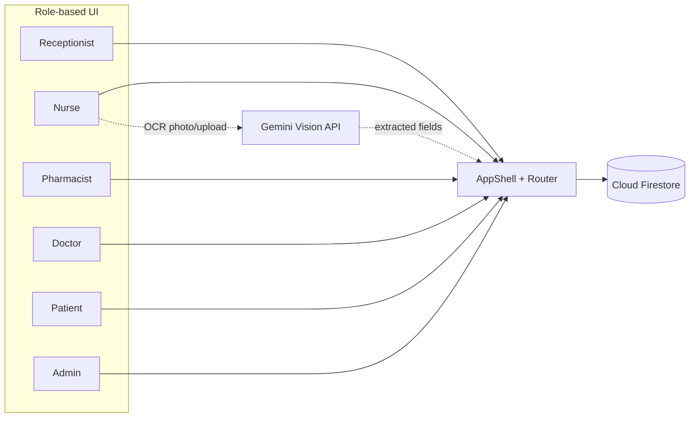

<div align="center">


# Zennith

**A real-time healthcare operations and supply chain platform connecting patients, healthcare workers, and clinics across South African public healthcare.**

[](https://react.dev)
[](https://www.typescriptlang.org/)
[](https://tanstack.com/start)
[](https://tailwindcss.com/)
[](https://ui.shadcn.com/)
[](https://vitejs.dev/)
[](https://workers.cloudflare.com/)
[]()

</div>

---

## 📖 Table of Contents

- [Introduction](#-introduction)
- [The Problem](#-the-problem)
- [Why Chronic Medication First](#-why-chronic-medication-first)
- [How It Works](#-how-it-works)
- [Roles & Features](#-roles--features)
- [Tech Stack](#-tech-stack)
- [Architecture](#-architecture)
- [Repository Structure](#-repository-structure)
- [Getting Started](#-getting-started)
- [Current Status & Roadmap](#-current-status--roadmap)
- [Known Issues & Decisions](#-known-issues--decisions)
- [Contributing](#-contributing)

---

## 🩺 Introduction

**Zennith** is a healthcare operations and supply chain management platform designed to improve how South African public health clinics manage medication, patient flow, and clinical operations.

Zennith doesn't replace the systems clinics already use — it acts as a **communication and coordination layer** connecting everyone involved in delivering care: patients, receptionists, nurses, pharmacists, doctors, and clinic administrators.

> **The goal:** Ensure the right medication reaches the right patient, at the right clinic, at the right time.

This project is **open source** — early-stage and actively being built. Expect rough edges; see [Known Issues & Decisions](#-known-issues--decisions) for a running, honest list of what's real, what's a placeholder, and what's still a decision waiting to be made.

## 🧩 The Problem

Research into public clinic operations found that most patient-facing problems weren't caused by medication shortages alone — they were caused by **poor communication and poor visibility**.

Healthcare workers often don't know:

- 📉 What medication is running low
- 🧍 Which patients are waiting
- 📦 Which nurse received which stock
- 🔁 Whether a reorder has already been placed
- 🏥 Which clinics still have available medication

Patients, in turn, often don't know whether medication is available, how long they'll wait, or whether it's ready for collection.

These gaps create delays, duplicate work, stockouts, and unnecessary paper administration — for staff and patients alike. Zennith exists to close them, by connecting every role to one real-time source of truth, where each user only ever sees the information relevant to them.

## 🎯 Why Chronic Medication First

Zennith is **not** only for chronic patients — chronic medication is simply the starting point.

Chronic medication represents one of the largest and most consistent medication workflows in South African public healthcare, which makes it the ideal proving ground. This follows an **Agile approach**: solve one well-defined problem thoroughly, gather real technical and operational feedback, then expand.

The long-term vision extends to acute medication, maternal healthcare, child immunisation, TB treatment, HIV programmes, emergency medication, hospital inventory, and medical consumables — eventually forming a unified national healthcare coordination platform.

## ⚙️ How It Works

Think of Zennith as the **digital nervous system** of a clinic. Every role has different responsibilities, but instead of everyone working independently on paper, Zennith connects them through one platform where information flows between departments in real time — filtered to what each role needs to see.

| Role                | Responsibility                                                                     |
| ------------------- | ---------------------------------------------------------------------------------- |
| 🧑‍💼 **Receptionist** | Patient registration and queue allocation                                          |
| 👩‍⚕️ **Nurse**        | Consultations, digitising patient files (OCR), dispensing medication, appointments |
| 💊 **Pharmacist**   | Inventory management, distribution, shortage monitoring, demand forecasting        |
| 🩺 **Doctor**       | Reviewing patient records and prescribing treatment                                |
| 🧑 **Patient**      | Checking appointments, medication availability, and receiving notifications        |
| 🏢 **Clinic Admin** | Visibility over operations, inventory, and performance                             |

## 🚀 Roles & Features

Zennith combines several operational functions that are usually handled by separate, disconnected systems:

- 🧾 Queue management
- 📦 Medication stock visibility & inventory tracking
- 🚚 Medication distribution between pharmacy and nursing teams
- 💉 Direct nurse-to-patient medication dispensing, with real-time stock deduction
- 📷 OCR digitisation of paper patient files (camera capture or upload)
- 📄 Real, downloadable PDF medical records
- 💬 Patient communication & notifications
- 🗂️ Digital patient records, editable by clinical staff with locked identity fields
- 📊 Predictive analytics for demand forecasting
- 🔁 Automated reorder support

Each role gets a dedicated, purpose-built interface, all reading from and writing to the same underlying data.

## 🛠️ Tech Stack

| Layer                               | Technology                                                                                   |
| ----------------------------------- | -------------------------------------------------------------------------------------------- |
| **UI Framework**                    | React 19 + TypeScript                                                                        |
| **App Framework**                   | [TanStack Start](https://tanstack.com/start) (full-stack, SSR)                               |
| **Routing**                         | [TanStack Router](https://tanstack.com/router) — file-based routes in `src/routes/`          |
| **Data Fetching / State**           | [TanStack Query](https://tanstack.com/query)                                                 |
| **Styling**                         | Tailwind CSS v4                                                                              |
| **Component Library**               | shadcn/ui + Radix UI primitives                                                              |
| **Forms & Validation**              | React Hook Form + Zod                                                                        |
| **Charts**                          | Recharts                                                                                     |
| **OCR (patient file digitisation)** | Gemini Vision API — **prototype, see [Known Issues & Decisions](#-known-issues--decisions)** |
| **PDF generation**                  | jsPDF — real, selectable-text PDFs, generated client-side, no paid API                       |
| **Build Tool**                      | Vite 7                                                                                       |
| **Package Manager**                 | Bun                                                                                          |
| **Deployment Target**               | Cloudflare Workers (via `wrangler`)                                                          |

## 🏗️ Architecture

Zennith is currently a **single, role-aware web application** rather than separate apps per role. Every role is expressed as its own route namespace via TanStack Router's file-based convention:

```
role.page.tsx        →  /role/page
pharmacist.stock.tsx  →  /pharmacist/stock
doctor.patients.tsx   →  /doctor/patients
```

A shared `AppShell` component provides the authenticated layout, and role-based access is enforced at the route/auth layer so each user is only ever routed to their own section of the app.

**Current state of the data layer:** the backend is **live on Firebase**. Authentication is Firebase Auth (email/password) with real authenticator-app 2FA, and roles are read from a Firestore `profiles` collection. The Pharmacist, Doctor, Nurse, Receptionist, and Admin modules, patient files, and medical records all read and write **Cloud Firestore**.

**Nurse module (most recently completed):** fully live — real-time appointments (Sunday–Saturday week view with a calendar picker), clinic-scoped patient lists and search, an editable Patient Record (clinical fields only — identity/registration fields stay locked), append-only clinical notes, real in-browser camera + Gemini-based OCR digitisation, real inventory-backed medication dispensing, and real downloadable PDF medical records.

The seeded in-memory store (`src/lib/data.ts`, `src/lib/store.ts`) still backs a small number of local-only features (offline queue, some legacy adherence handling) — most pages have migrated off it.

> **Two `clinic` modules — check which you need:** `src/lib/clinic.ts` is the **multi-facility selector** (`CLINICS`, `useActiveClinic()`, `ClinicId`, `splitByClinic()`, localStorage-backed — drives the clinic switcher and login picker). `src/lib/clinic-data.ts` is the **Firestore data-access layer** shared by Doctor/Nurse/Receptionist/Patient data. Pharmacy has its own service in `src/lib/pharmacist-service.ts`, and Nurse-specific logic (digitize, dispense, handover, adherence) lives in `src/lib/nurse-service.ts`.



## 📁 Repository Structure

```
Zennith/
├── src/
│   ├── routes/                             ← File-based routes (TanStack Router)
│   │   ├── pharmacist.tsx                  ← Pharmacist layout
│   │   ├── pharmacist.index.tsx            ← Pharmacist dashboard
│   │   ├── pharmacist.stock.tsx            ← Inventory / stock levels
│   │   ├── pharmacist.distribution.tsx     ← Distribution to clinics/nurses
│   │   ├── pharmacist.analytics.tsx        ← Demand forecasting & analytics
│   │   ├── pharmacist.diagnostics.tsx      ← Diagnostics view
│   │   ├── doctor.*.tsx                    ← Doctor routes
│   │   ├── nurse.index.tsx                 ← Nurse dashboard
│   │   ├── nurse.appointments.tsx          ← Week view + calendar picker
│   │   ├── nurse.digitize.tsx              ← Camera/upload OCR digitisation
│   │   ├── nurse.patients.tsx              ← Clinic-scoped patient list + search
│   │   ├── nurse.patient-record.$pid.tsx   ← Patient record route wrapper
│   │   ├── patient.*.tsx                   ← Patient routes
│   │   ├── receptionist.*.tsx              ← Receptionist routes
│   │   ├── admin.*.tsx / super-admin.*.tsx ← Admin routes
│   │   └── login.tsx / signup.tsx / two-factor.tsx
│   ├── components/
│   │   ├── AppShell.tsx                    ← Authenticated app layout/shell
│   │   ├── AuthBackground.tsx
│   │   ├── PatientRecordView.tsx           ← Shared Nurse/Doctor record view — edit, dispense, PDF, print
│   │   └── ui/                             ← shadcn/ui component primitives
│   ├── firebase.ts                         ← Firebase init from .env (auth + Firestore)
│   ├── context/AuthContext.tsx             ← Firebase session/role provider
│   ├── lib/
│   │   ├── auth.ts                         ← Firebase Auth + Firestore roles, facility scoping, 2FA secrets
│   │   ├── clinic-data.ts                  ← Firestore data layer (doctor/nurse/reception/patients)
│   │   ├── doctor-service.ts               ← Shared clinical hooks (appointments, patient directory/record — reused by Nurse)
│   │   ├── nurse-service.ts                ← Nurse-specific: digitize, handover, adherence, dispense
│   │   ├── pharmacist-service.ts           ← Firestore data layer (pharmacy: stock, distribution, trends)
│   │   ├── gemini-ocr.ts                   ← Gemini Vision OCR — prototype, see Known Issues
│   │   ├── pdf-export.ts                   ← Real client-side PDF generation (jsPDF)
│   │   ├── patient-service.ts              ← Patient-portal data layer
│   │   ├── totp.ts                         ← RFC 6238 TOTP (two-factor auth)
│   │   ├── welcome-email.ts                ← Patient signup confirmation email (Resend, server-side)
│   │   ├── store.ts / data.ts              ← Legacy in-memory store (small number of pages still use this)
│   │   ├── clinic.ts                       ← Multi-clinic/facility selector
│   │   ├── facilities.ts / handover.ts / notifications.ts / notifications-queue.ts / audit.ts
│   │   └── offline.ts / adherence.ts / search-index.ts / utils.ts
│   ├── router.tsx                          ← Router + QueryClient setup
│   ├── server.ts                           ← SSR server entry (Cloudflare Worker)
│   └── styles.css
├── scripts/                                ← Firestore seeding & data management (Node)
│   ├── reset-to-demo.mjs                   ← DESTRUCTIVE — resets to a clean 10-account demo set
│   ├── generate-demo-data.mjs              ← Additive — tops every collection to ~10 rows
│   ├── generate-nurse-demo-data.mjs        ← Additive — 2 dense demo clinics (30 patients each) for Nurse-module demos
│   ├── create-superadmin.mjs               ← Creates/repairs the superadmin account
│   ├── seed-users.mjs / migrate-logins.mjs ← Auth account setup/migration helpers
├── docs/
│   ├── db-issues.md                        ← Running log of schema issues, gaps, and decisions — read before assuming a field exists
│   ├── FIREBASE.md                         ← Console setup, security rules, operational runbook
│   └── ARCHITECTURE.md                     ← Data model detail
├── public/                                 ← Static assets
├── vite.config.ts
├── wrangler.jsonc                          ← Cloudflare Workers deployment config
├── tsconfig.json
└── package.json
```

## 🏁 Getting Started

> ⚠️ **Every command below must be run from inside the project folder** (`cd Zennith` first). Running `bun`/`node`/`git` commands from anywhere else, or from a terminal not opened inside the repo, is the single most common reason "nothing works" — the app isn't broken, the terminal just isn't pointed at it.

### Prerequisites

- [Bun](https://bun.sh/) installed
- Node.js (for tooling compatibility — the seeding scripts in `scripts/` run under Node, not Bun)

**Installing Bun** (if `bun --version` doesn't work yet):

| OS                                | Command                                                                                                                |
| --------------------------------- | ---------------------------------------------------------------------------------------------------------------------- |
| **macOS**                         | `curl -fsSL https://bun.sh/install \| bash` then restart your terminal (or run `source ~/.zshrc` / `source ~/.bashrc`) |
| **Linux / Ubuntu (WSL included)** | `curl -fsSL https://bun.sh/install \| bash` then restart your terminal (or run `source ~/.bashrc`)                     |
| **Windows**                       | `powershell -c "irm bun.sh/install.ps1 \| iex"` (run in PowerShell)                                                    |

VERY CRITICAL: PLEASE KILL TERMINAL AND CLOSE VS CODE AFTER SUCCESSFULLY RUNNING THE COMMAND, then reopen the project fresh.

Verify it worked:

```bash
bun --version
```

### Installation

> ⚠️ **Run this once** — the first time you set up the project on a machine. You do **not** need to re-run this every time you pull changes or edit a file; it only needs to run again if `package.json` changes (e.g. a new dependency was added).

```bash
# Clone the repository
git clone <repo-url>
cd Zennith

# Install dependencies (one-time setup — creates node_modules/)
bun install
```

**If you pull changes that add a new dependency** (check `package.json` for anything you don't recognise, or just watch for an import-not-found error), run `bun install` again — or install the specific package directly, e.g.:

```bash
bun add jspdf
```

### Environment variables (required — the app talks to Firebase, and optionally Gemini)

Copy `.env.example` to `.env` and fill in the values. **Plain `KEY=value`
lines only** — pasting the JavaScript config object from the Firebase console breaks
every value and produces a misleading `PERMISSION_DENIED` error.

```
VITE_FIREBASE_API_KEY=...
VITE_FIREBASE_AUTH_DOMAIN=zennith-d6faa.firebaseapp.com
VITE_FIREBASE_PROJECT_ID=zennith-d6faa
VITE_FIREBASE_STORAGE_BUCKET=zennith-d6faa.firebasestorage.app
VITE_FIREBASE_MESSAGING_SENDER_ID=...
VITE_FIREBASE_APP_ID=...

# optional: patient-signup confirmation email (server-side only, no VITE_ prefix)
RESEND_API_KEY=

# optional: Nurse Digitize OCR — PROTOTYPE, see docs/db-issues.md #19 before
# using with any real patient data. Get a free key at https://aistudio.google.com/apikey
VITE_GEMINI_API_KEY=
```

> ⚠️ **After editing `.env`, restart the dev server** — Vite only reads `.env` on startup, a browser refresh alone won't pick up a new value.

Full console setup, security rules and operational runbook:
[docs/FIREBASE.md](docs/FIREBASE.md). Architecture and data model:
[docs/ARCHITECTURE.md](docs/ARCHITECTURE.md). Known schema gaps, bugs, and open decisions — **read this before assuming a field exists or a behaviour is finished:**
[docs/db-issues.md](docs/db-issues.md).

### Seeding the database

```bash
node scripts/reset-to-demo.mjs           # clean 10-account demo set (DESTRUCTIVE)
node scripts/generate-demo-data.mjs      # top every collection up to ~10 records
node scripts/generate-nurse-demo-data.mjs # 2 dense demo clinics, 30 patients each — for Nurse-module demos/presentations
node scripts/create-superadmin.mjs       # create/repair the superadmin account (additive)
```

Run them in that order on a fresh setup. The last three are additive and safe to re-run at any time; only `reset-to-demo.mjs` is destructive.

### Everyday Workflow

Once set up, your day-to-day loop is just:

```bash
git pull        # pull the latest changes from the team
bun run dev     # start the local dev server
```

Then open the URL shown in your terminal (Vite's default is `http://localhost:5173`, though this project commonly runs on `http://localhost:8080` depending on config). Edits you save to any file will hot-reload in the browser automatically — no restart or reinstall needed, **except** after editing `.env` (see above) or after `bun install`/`bun add` (restart the dev server).

### Other available scripts

| Command           | Description                          |
| ----------------- | ------------------------------------ |
| `bun run dev`     | Start the local development server   |
| `bun run build`   | Build for production                 |
| `bun run preview` | Preview the production build locally |
| `bun run lint`    | Run ESLint                           |
| `bun run format`  | Format code with Prettier            |

### 🔑 Test Login Credentials (real Firebase Auth)

Auth is **real Firebase Authentication**. Usernames without an `@` map to
`<username>@zennith.test` behind the scenes. Log in with the **role name as the
username** and `password` as the password:

| Role             | Username       | Password   | Notes                                                             |
| ---------------- | -------------- | ---------- | ----------------------------------------------------------------- |
| Doctor           | `doctor`       | `password` | Hillbrow CHC                                                      |
| Doctor (2nd)     | `doctor2`      | `password` |                                                                   |
| Nurse            | `nurse`        | `password` | Hillbrow CHC — 30 demo patients after seeding                     |
| Nurse (2nd)      | `nurse2`       | `password` | **Berea CHC** — a genuinely separate clinic, own 30 demo patients |
| Patient          | `patient`      | `password` |                                                                   |
| Patient (2nd)    | `patient2`     | `password` |                                                                   |
| Pharmacist       | `pharmacist`   | `password` |                                                                   |
| Pharmacist (2nd) | `pharmacist2`  | `password` |                                                                   |
| Receptionist     | `receptionist` | `password` |                                                                   |
| Admin            | `admin`        | `password` |                                                                   |
| Super Admin      | `superadmin`   | `password` | Sees every facility, not scoped to one                            |

> ⚠️ Usernames must match exactly (e.g. `pharmacist`, not `Pharmacist` or a made-up name). Run `node scripts/generate-nurse-demo-data.mjs` first if you want `nurse`/`nurse2` to show two richly-populated, genuinely different clinics for a demo or presentation, rather than the thin/scattered default set.

> 🔐 **Two-factor authentication is real.** After the password step, the first login
> for each account shows a **QR code** — scan it with Google Authenticator / Authy /
> Microsoft Authenticator, then enter the 6-digit code to activate 2FA. Every later
> login requires the current rotating code. Random digits no longer work. To reset an
> account's 2FA, delete the `totpSecret` field from its document in the Firestore
> `profiles` collection.

## 🧭 Current Status & Roadmap

Zennith has moved from prototype to a **Firebase-backed application** — every role has a working interface, and authentication plus clinical and pharmacy data are live in Firestore.

- [x] Role-based UI for all 7 roles (patient, receptionist, nurse, pharmacist, doctor, admin, super admin)
- [x] Multi-clinic / multi-facility support + facility-scoped audit log
- [x] Real authentication & session management (Firebase Auth + TOTP two-factor)
- [x] Persistent database (Cloud Firestore) + seeding/management scripts, including dense two-clinic demo data
- [x] Pharmacist backend: stock, distribution, dispense trends
- [x] Doctor / Receptionist / Admin modules on live Firestore
- [x] **Nurse module: fully live** — appointments (real week view + calendar), clinic-scoped patients, editable records, dispense-to-patient with real inventory deduction, camera + Gemini OCR digitisation, real PDF export
- [x] Patient self-signup with confirmation email (Resend)
- [ ] Pharmacist inventory scoped per-clinic (schema now supports it — `useInventory()` doesn't filter by clinic yet, see docs/db-issues.md #2)
- [ ] Gemini OCR moved off free tier and/or behind a real backend before any real patient data goes through it (docs/db-issues.md #19)
- [ ] Per-role Firestore security rules (currently authenticated-users-only — see docs/FIREBASE.md and docs/db-issues.md)
- [ ] Real-time sync on a couple of remaining Nurse write paths (edit/dispense currently need a manual refresh to reflect on the Patients list — docs/db-issues.md #18)
- [ ] Expansion beyond chronic medication

## 📋 Known Issues & Decisions

Every schema gap, workaround, bug, and open design decision found while building this is tracked in one place, kept current, and meant to actually be read — not a graveyard file:

➡️ **[docs/db-issues.md](docs/db-issues.md)**

If you're about to assume a field exists, that a placeholder is production-ready, or that a "we'll fix it later" note has been forgotten — check there first.

## 🤝 Contributing

This project is **open source** and currently in active early-stage development — expect things to move fast and break. If you're on the core team, please coordinate feature work through the project board/issues before starting, and open a PR against the relevant branch for review. External contributions and issue reports are welcome once the project has stabilised past its current sprint pace.

---

<div align="center">

**Zennith** — improving visibility, communication, and access to essential healthcare across South African public clinics.

</div>
