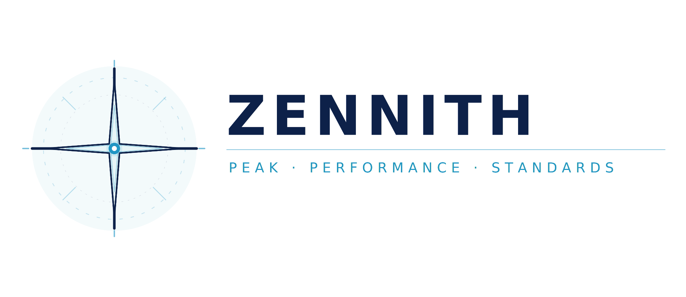
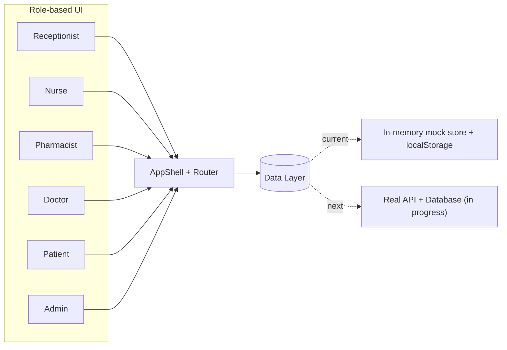

<div align="center">



# Zennith

**A real-time healthcare operations and supply chain platform connecting patients, healthcare workers, and clinics across South African public healthcare.**

[](https://react.dev)
[](https://www.typescriptlang.org/)
[](https://tanstack.com/start)
[](https://tailwindcss.com/)
[](https://ui.shadcn.com/)
[](https://vitejs.dev/)
[](https://workers.cloudflare.com/)
[]()

</div>

---

## 📖 Table of Contents

- [Introduction](#-introduction)
- [The Problem](#-the-problem)
- [Why Chronic Medication First](#-why-chronic-medication-first)
- [How It Works](#-how-it-works)
- [Roles & Features](#-roles--features)
- [Tech Stack](#-tech-stack)
- [Architecture](#-architecture)
- [Repository Structure](#-repository-structure)
- [Getting Started](#-getting-started)
- [Current Status & Roadmap](#-current-status--roadmap)
- [Contributing](#-contributing)

---

## 🩺 Introduction

**Zennith** is a healthcare operations and supply chain management platform designed to improve how South African public health clinics manage medication, patient flow, and clinical operations.

Zennith doesn't replace the systems clinics already use — it acts as a **communication and coordination layer** connecting everyone involved in delivering care: patients, receptionists, nurses, pharmacists, doctors, and clinic administrators.

> **The goal:** Ensure the right medication reaches the right patient, at the right clinic, at the right time.

## 🧩 The Problem

Research into public clinic operations found that most patient-facing problems weren't caused by medication shortages alone — they were caused by **poor communication and poor visibility**.

Healthcare workers often don't know:
- 📉 What medication is running low
- 🧍 Which patients are waiting
- 📦 Which nurse received which stock
- 🔁 Whether a reorder has already been placed
- 🏥 Which clinics still have available medication

Patients, in turn, often don't know whether medication is available, how long they'll wait, or whether it's ready for collection.

These gaps create delays, duplicate work, stockouts, and unnecessary paper administration — for staff and patients alike. Zennith exists to close them, by connecting every role to one real-time source of truth, where each user only ever sees the information relevant to them.

## 🎯 Why Chronic Medication First

Zennith is **not** only for chronic patients — chronic medication is simply the starting point.

Chronic medication represents one of the largest and most consistent medication workflows in South African public healthcare, which makes it the ideal proving ground. This follows an **Agile approach**: solve one well-defined problem thoroughly, gather real technical and operational feedback, then expand.

The long-term vision extends to acute medication, maternal healthcare, child immunisation, TB treatment, HIV programmes, emergency medication, hospital inventory, and medical consumables — eventually forming a unified national healthcare coordination platform.

## ⚙️ How It Works

Think of Zennith as the **digital nervous system** of a clinic. Every role has different responsibilities, but instead of everyone working independently on paper, Zennith connects them through one platform where information flows between departments in real time — filtered to what each role needs to see.

| Role | Responsibility |
|---|---|
| 🧑‍💼 **Receptionist** | Patient registration and queue allocation |
| 👩‍⚕️ **Nurse** | Consultations and digitising patient files |
| 💊 **Pharmacist** | Inventory management, distribution, shortage monitoring, demand forecasting |
| 🩺 **Doctor** | Reviewing patient records and prescribing treatment |
| 🧑 **Patient** | Checking appointments, medication availability, and receiving notifications |
| 🏢 **Clinic Admin** | Visibility over operations, inventory, and performance |

## 🚀 Roles & Features

Zennith combines several operational functions that are usually handled by separate, disconnected systems:

- 🧾 Queue management
- 📦 Medication stock visibility & inventory tracking
- 🚚 Medication distribution between pharmacy and nursing teams
- 💬 Patient communication & notifications
- 🗂️ Digital patient records
- 📊 Predictive analytics for demand forecasting
- 🔁 Automated reorder support

Each role gets a dedicated, purpose-built interface, all reading from and writing to the same underlying data.

## 🛠️ Tech Stack

| Layer | Technology |
|---|---|
| **UI Framework** | React 19 + TypeScript |
| **App Framework** | [TanStack Start](https://tanstack.com/start) (full-stack, SSR) |
| **Routing** | [TanStack Router](https://tanstack.com/router) — file-based routes in `src/routes/` |
| **Data Fetching / State** | [TanStack Query](https://tanstack.com/query) |
| **Styling** | Tailwind CSS v4 |
| **Component Library** | shadcn/ui + Radix UI primitives |
| **Forms & Validation** | React Hook Form + Zod |
| **Charts** | Recharts |
| **Build Tool** | Vite 7 |
| **Package Manager** | Bun |
| **Deployment Target** | Cloudflare Workers (via `wrangler`) |

## 🏗️ Architecture

Zennith is currently a **single, role-aware web application** rather than separate apps per role. Every role is expressed as its own route namespace via TanStack Router's file-based convention:

```
role.page.tsx        →  /role/page
pharmacist.stock.tsx  →  /pharmacist/stock
doctor.patients.tsx   →  /doctor/patients
```

A shared `AppShell` component provides the authenticated layout, and role-based access is enforced at the route/auth layer so each user is only ever routed to their own section of the app.

**Current state of the data layer:** the app currently runs on a seeded, in-memory mock data store (`src/lib/data.ts`, `src/lib/store.ts`) and `localStorage`-based session handling (`src/lib/auth.ts`) — this lets the full product experience be demoed and tested end-to-end before the real backend is wired in. This is the foundation the backend work (starting with the **pharmacist module**) will replace with real persistence, authentication, and APIs.



## 📁 Repository Structure

```
Zennith/
├── src/
│   ├── routes/                        ← File-based routes (TanStack Router)
│   │   ├── pharmacist.tsx             ← Pharmacist layout
│   │   ├── pharmacist.index.tsx       ← Pharmacist dashboard
│   │   ├── pharmacist.stock.tsx       ← Inventory / stock levels
│   │   ├── pharmacist.distribution.tsx← Distribution to clinics/nurses
│   │   ├── pharmacist.analytics.tsx   ← Demand forecasting & analytics
│   │   ├── pharmacist.diagnostics.tsx ← Diagnostics view
│   │   ├── doctor.*.tsx               ← Doctor routes
│   │   ├── nurse.*.tsx                ← Nurse routes
│   │   ├── patient.*.tsx              ← Patient routes
│   │   ├── receptionist.*.tsx         ← Receptionist routes
│   │   ├── admin.*.tsx / super-admin.*.tsx ← Admin routes
│   │   └── login.tsx / signup.tsx / two-factor.tsx
│   ├── components/
│   │   ├── AppShell.tsx               ← Authenticated app layout/shell
│   │   ├── AuthBackground.tsx
│   │   ├── PatientRecordView.tsx
│   │   └── ui/                        ← shadcn/ui component primitives
│   ├── lib/
│   │   ├── auth.ts                    ← Auth state (currently localStorage-based)
│   │   ├── store.ts                   ← Reactive in-memory data store
│   │   ├── data.ts                    ← Seeded mock clinic dataset
│   │   ├── clinic.ts                  ← Multi-clinic logic
│   │   ├── facilities.ts              ← Facility management
│   │   ├── handover.ts                ← Shift/handover logic
│   │   ├── notifications.ts           ← Role-based notifications
│   │   ├── audit.ts                   ← Audit logging
│   │   └── offline.ts / search-index.ts / utils.ts
│   ├── router.tsx                     ← Router + QueryClient setup
│   ├── server.ts                      ← SSR server entry (Cloudflare Worker)
│   └── styles.css
├── public/                            ← Static assets
├── vite.config.ts
├── wrangler.jsonc                     ← Cloudflare Workers deployment config
├── tsconfig.json
└── package.json
```

## 🏁 Getting Started

### Prerequisites
- [Bun](https://bun.sh/) installed
- Node.js (for tooling compatibility)

**Installing Bun** (if `bun --version` doesn't work yet):

| OS | Command |
|---|---|
| **macOS / Linux / Ubuntu (WSL included)** | `curl -fsSL https://bun.sh/install \| bash` then restart your terminal (or run `source ~/.bashrc`) |
| **Windows** | `powershell -c "irm bun.sh/install.ps1 \| iex"` (run in PowerShell) |

VERY CRITICAL : PLEASE KILL TERMINAL AND CLOSE VS CODE AFTER SUCCESSFULLY RUNNING THE COMMAND

Verify it worked:
```bash
bun --version
```

### Installation

> ⚠️ **Run this once** — the first time you set up the project on a machine. You do **not** need to re-run this every time you pull changes or edit a file; it only needs to run again if `package.json` changes (e.g. a new dependency was added).

```bash
# Clone the repository
git clone <repo-url>
cd Zennith

# Install dependencies (one-time setup — creates node_modules/)
bun install
```

### Everyday Workflow

Once set up, your day-to-day loop is just:

```bash
git pull        # pull the latest changes from the team
bun run dev     # start the local dev server
```

Then open the URL shown in your terminal (Vite's default is `http://localhost:5173`). Edits you save to any file (e.g. `pharmacist.stock.tsx`) will hot-reload in the browser automatically — no restart or reinstall needed.

### Other available scripts

| Command | Description |
|---|---|
| `bun run dev` | Start the local development server |
| `bun run build` | Build for production |
| `bun run preview` | Preview the production build locally |
| `bun run lint` | Run ESLint |
| `bun run format` | Format code with Prettier |

### 🔑 Test Login Credentials (Mock Auth)

Auth is currently mocked (`src/lib/auth.ts`) — not real authentication yet. To log in as a given role, use that **role name as the username** and `password` as the password:

| Role | Username | Password |
|---|---|---|
| Pharmacist | `pharmacist` | `password` |
| Doctor | `doctor` | `password` |
| Nurse | `nurse` | `password` |
| Receptionist | `receptionist` | `password` |
| Patient | `patient` | `password` |
| Admin | `admin` | `password` |
| Super Admin | `superadmin` | `password` |

> ⚠️ Usernames must match exactly (e.g. `pharmacist`, not `Pharmacist` or a made-up name) — any other username/password combo won't be recognized since these are the only accounts seeded into the mock store.

## 🧭 Current Status & Roadmap

Zennith is currently a **fully functional frontend prototype**: every role has a working interface, driven by realistic seeded data and an in-memory reactive store, so the full product experience can be demoed and validated end-to-end.


- [x] Role-based UI for all 7 roles (patient, receptionist, nurse, pharmacist, doctor, admin, super admin)
- [x] Multi-clinic support (Hillbrow CHC, Orchards Clinic, Yeoville CHC)
- [x] Mock data layer + in-memory reactive store
- [ ] Real authentication & session management
- [ ] Persistent database
- [ ] Pharmacist backend: stock, distribution, forecasting APIs *(current focus)*
- [ ] Real-time sync across roles
- [ ] Expansion beyond chronic medication

## 🤝 Contributing

This is a private, team-based project. If you're on the team, please coordinate feature work through the project board/issues before starting, and open a PR against the relevant branch for review.

---

<div align="center">

**Zennith** — improving visibility, communication, and access to essential healthcare across South African public clinics.

</div>
