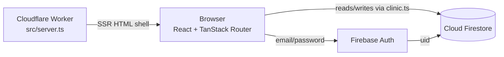

# Zennith — Architecture

## Overview

Zennith is a single-page React application (TanStack Start, SSR on Cloudflare
Workers) that talks **directly to Firebase** from the browser — there is no
custom API server. Authentication is Firebase Auth; all domain data lives in
Cloud Firestore; server state is cached with TanStack Query.

## Authentication flow

1. **Password** — `login.tsx` calls `checkCredentials(username, password)`
   ([src/lib/auth.ts](../src/lib/auth.ts)). A bare username is mapped to
   `<username>@zennith.test`; a full email passes through. Firebase Auth
   verifies the password.
2. **Role lookup** — the user's role comes from `profiles/{authUid}` in
   Firestore. No profile → sign-in rejected ("no role assigned").
3. **Two-factor** — `two-factor.tsx` + [src/lib/totp.ts](../src/lib/totp.ts)
   (RFC 6238 TOTP, SHA-1/30s/6-digit, verified against the RFC test vector).
   First login shows a setup key to add to an authenticator app; the first
   valid code stores the secret at `profiles/{uid}.totpSecret`. Later logins
   verify the rotating code (±30s drift window).
4. **Session** — after 2FA, `setAuth(role, username)` caches the role in
   `localStorage`. Route guards (`beforeLoad` in each `<role>.tsx` layout) read
   this cache **synchronously**, so guards work before Firebase resolves.
   `AuthContext` listens to Firebase auth state and reconciles the cache
   (clears it on sign-out). Firestore remains the source of truth.

### Why the localStorage role cache?

TanStack Router's `beforeLoad` runs synchronously on navigation — before the
async Firebase session resolves. The cache makes guards instant; it is
UI-routing convenience, **not** security (see Security below).

## Firestore data model

The dataset was imported from a relational design; documents keep their
foreign keys. **Bold** collections were added by the app.

| Collection | Doc ID | Key fields | Joins |
|---|---|---|---|
| `users` | numeric (`"1"`) | userId, names, surname, role, email, idNumber, contactNum, city, suburb | referenced by everything via `userId` |
| `userCredentials` | numeric | userId, userName, password (mostly **bcrypt hashes**) | legacy import; not used at runtime |
| `patients` | `Pat-N` | patientId, userId, medicalRecordNo, chronicCondition, emergencyContact* | → users, medicalRecords |
| `doctors` | `Doc-N` | doctorId, userId, specialisation, licenseNo | → users; ← appointments.clinician |
| `nurses` | `Nur-N` | nurseId, userId, clinicId, specialisation | → users, clinics |
| `pharmacists` / `receptionists` | `Pharm-N` / `Rec-N` | …Id, userId | → users |
| `appointments` | numeric | appointmentId, appointDateTime (ISO string), appointType, clinician (`Doc-N`/`Nur-N`), patientId, status | → patients, doctors/nurses |
| `medicalRecords` | numeric | medicalRecordNo, bloodType, allergies, bp, glucose, cd4, viralLoad, prescription, dosage, insurancePolicyNumber, lastVisit | ← patients.medicalRecordNo |
| `medicalRecordsHistory` | numeric | historyId, medicalRecordNo, patientId, description | → medicalRecords, patients |
| `inventory` | numeric | inventId, medName, category, quantity, threshold, lastUpdated | ← distributions, reorders |
| `distributions` | numeric/auto | distributionId, inventId, medName, nurseName, unitsGiven, date, createdAt | → inventory |
| `reorders` | numeric | reorderId, inventId, medName, requestedBy, status, date | → inventory |
| `clinics` | numeric | clinicId, clinicName, Coordinates | ← nurses.clinicId |
| `notifications` | numeric | notifId, userId, title, message, isRead, timeSent | → users |
| `adminRecords` | numeric | adminRecordId, userIdAdded, timeStampCreated | audit-style |
| **`profiles`** | **Firebase Auth UID** | username, role, fullName, email, legacyUserId, totpSecret, builtin, createdAt | the auth ↔ dataset bridge |
| **`counters`** | `registration` | patientNo, userNo, recordNo | transactional ID allocation |

**The bridge:** Firebase Auth identifies people by UID; the dataset identifies
them by numeric `userId`. `profiles/{uid}.legacyUserId` links the two — e.g.
the doctor dashboard resolves *uid → legacyUserId → doctors.userId → doctorId →
appointments.clinician*.

Appointment status vocabulary: Firestore stores `Completed / Scheduled /
In Progress / No-Show`; the UI's `StatusBadge` uses `Complete / Incomplete /
In-progress / No-show`. `clinic.ts` maps both directions.

## Data-access layer

All Firestore domain logic lives in [src/lib/clinic.ts](../src/lib/clinic.ts);
pages consume it through TanStack Query (`useQuery` for reads, `useMutation` +
cache invalidation for writes). Notable design points:

- **No composite indexes required** — queries use single equality filters or a
  single orderBy; multi-condition filtering happens client-side.
- **Joins are explicit** — Firestore has no joins, so helpers like
  `attachPatientNames()` batch `getDoc` calls (`patients/{id}` → `users/{id}`).
- **Writes are transactional where it matters** — stock deduction
  (`distributeStock`), supplier intake (`receiveStock`), and registration ID
  allocation (`registerPatient` via the `counters` doc) all use
  `runTransaction`, so over-allocation and ID races are rejected server-side.
- **Admin user creation uses a secondary Firebase app** — the client SDK signs
  in as any newly created user, which would replace the admin's session;
  `createStaffUser`/`addUser` create accounts on a throwaway app instance.
- **Historic dataset dates** — dashboards pick "today if it has data, else the
  most recent day that does", labelling the date when it isn't today.

## Feature status (live Firestore vs mock)

| Area | Status |
|---|---|
| Login, 2FA, sign-out, route guards | ✅ Live |
| Admin: dashboard, create user, all staff | ✅ Live |
| Doctor: dashboard, schedule, appointments (status writes + booking), patient files, patient record | ✅ Live |
| Nurse: patient files + patient record (shared components) | ✅ Live |
| Pharmacist: stock, distribution (transactional writes) | ✅ Live |
| Receptionist: appointments (booking), registration (creates users/patients/medicalRecords) | ✅ Live |
| Nurse: dashboard, appointments, digitize | 🔶 Mock (`lib/data.ts` / `lib/store.ts`) |
| Receptionist: dashboard, patient profiles | 🔶 Mock |
| Patient portal: dashboard, medical record, appointments, alerts | 🔶 Mock |
| Pharmacist: dashboard, analytics, diagnostics | 🔶 Mock |
| Notification bell, global search, forgot-password, signup page | 🔶 Mock |
| Nurse adherence badges, shift handover, offline indicator | 🔶 Local-only features (localStorage) |

`lib/data.ts` and `lib/store.ts` can be deleted once the remaining 🔶 pages are
migrated to `clinic.ts` queries.

## Security posture (honest assessment)

Current state is **development/demo grade**:

- Firestore rules: `allow read, write: if request.auth != null` — any signed-in
  user can read/write any document. Fine for a demo; per-role rules are
  sketched in [FIREBASE.md](FIREBASE.md).
- 2FA verification runs client-side and the TOTP secret is readable by the
  signed-in client. Production path: Firebase **Identity Platform** TOTP MFA
  (server-side verification, enrollment APIs).
- The role cache in localStorage can be edited by the user — it only changes
  which UI renders. Real protection must come from Firestore rules keyed on
  `profiles/{request.auth.uid}.role`.
- `userCredentials` (imported) contains bcrypt hashes and a few plaintext
  passwords. It is unused at runtime — consider deleting it before any public
  deployment.
- Deleting staff in the admin UI removes the Firestore profile only; the Auth
  record needs the console or an Admin SDK backend (e.g. a Cloud Function).
